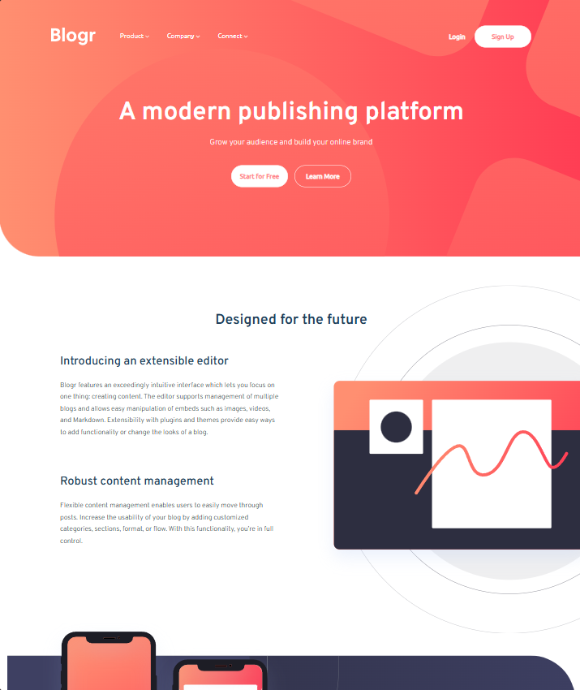

# Frontend Mentor - Blogr landing page solution

This is a solution to the [Blogr landing page challenge on Frontend Mentor](https://www.frontendmentor.io/challenges/blogr-landing-page-EX2RLAApP). Frontend Mentor challenges help you improve your coding skills by building realistic projects.

## Table of contents

- [Overview](#overview)
  - [The challenge](#the-challenge)
  - [Screenshot](#screenshot)
  - [Links](#links)
- [My process](#my-process)
  - [Built with](#built-with)
  - [What I learned](#what-i-learned)
  - [Continued development](#continued-development)
  - [Useful resources](#useful-resources)
  - [AI Collaboration](#ai-collaboration)
- [Author](#author)

## Overview

### The challenge

Users should be able to:

- View the optimal layout for the site depending on their device's screen size
- See hover states for all interactive elements on the page

### Screenshot



### Links

- Solution URL: [My Solution in FrontendMentor](https://www.frontendmentor.io/solutions/blogr-landing-page-oeAqxFkdiD)
- Live Site URL: [blogr-landing-page](https://ggandream.github.io/blogr-landing-page/)

## My process

### Built with

- Semantic HTML5 markup
- CSS custom properties
- Flexbox
- Mobile-first workflow
- Responsive images with the `<picture>` element
- Self-hosted web fonts ([Overpass](https://fonts.google.com/specimen/Overpass) & [Ubuntu](https://fonts.google.com/specimen/Ubuntu))
- Vanilla JavaScript (DOM manipulation & event handling)

### What I learned

**A single click handler for the whole mobile menu (event delegation).**
Instead of adding a listener to every dropdown button, I attached one listener to
the parent menu and checked what was actually clicked. This keeps the code shorter
and still works if items change:

```js
$navigation__menu.addEventListener("click", (e) => {
  if (e.target.matches(".navigation__item")) {
    e.target.nextElementSibling.classList.toggle("hidden");
    e.target.firstElementChild.classList.toggle("upsidedown");
  }
});
```

**Serving the right image for each screen size with `<picture>`.**
The illustrations differ between mobile and desktop, so I used `<picture>` with a
`media` condition instead of loading both and hiding one:

```html
<picture class="section__picture">
  <source srcset="images/illustration-editor-desktop.svg" media="(min-width: 768px)" />
  
</picture>
```

**Keeping the accessibility state in sync with the UI.**
When a dropdown opens or closes, the toggle state has to be reflected for assistive
tech too — not just visually — so I updated `aria-expanded` alongside the class:

```js
nav__item.setAttribute("aria-expanded", String(!isExpanded));
```

### Continued development
- Adding full keyboard support to the dropdowns (arrow keys, closing on `Esc` from
  anywhere, returning focus to the trigger).
- Getting more comfortable with when to reach for CSS Grid vs. Flexbox on layouts
  like this one.

### Useful resources
- [MDN – The `<picture>` element](https://developer.mozilla.org/en-US/docs/Web/HTML/Element/picture) - Helped me understand responsive images and `srcset`/`media`.
- [MDN – Event delegation](https://developer.mozilla.org/en-US/docs/Learn/JavaScript/Building_blocks/Events#event_delegation) - Explained why one listener on the parent can handle many children.
- [MDN – ARIA: `aria-expanded`](https://developer.mozilla.org/en-US/docs/Web/Accessibility/ARIA/Attributes/aria-expanded) - Clarified how to communicate open/closed state to assistive tech.

### AI Collaboration

I used an AI assistant to review my markup for accessibility improvements. Rather
than have it write the code, I asked it to look over what I'd built and point out
where the experience could be better for keyboard and screen-reader users.

## Author

- Frontend Mentor - [@ggandream](https://www.frontendmentor.io/profile/ggandream)
- GitHub - [@ggandream](https://github.com/ggandream)

## Acknowledgments
Challenge by Frontend Mentor. Thanks to [@Renato6GS](https://github.com/Renato6GS) for the guidance throughout this project.
